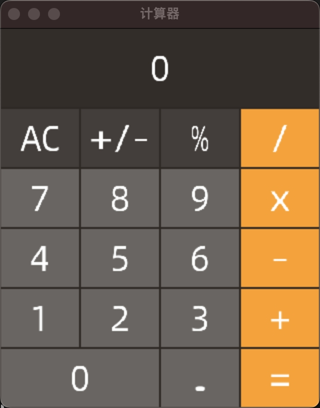

# uiengine

##
```
brew install sdl2
brew install sdl2_ttf
```

```
make demo
./demo
```

## demo cacualtor


## UI & Renderer pipeline
1:
```
vsync  thread:      vsync        vsync                           vsync
ui     thread:      frame        (event)(update)(frame2)         (event)(update)(frame3)
render thread:                   frame1                          frame2
```

2:
```
vsync  thread:      vsync        vsync                           vsync
ui     thread:      frame        (event)(update)(frame)          (event)(update)(frame)
                                     |
                                     | put
                                     |
                                 buffer queue (2)
                                     |
                                     | get
                                     |
render thread:                   frame                           frame
```

## reference
### [html lexer grammer](https://github.com/antlr/grammars-v4/blob/master/html/HTMLLexer.g4)
### [html parser grammer](https://github.com/antlr/grammars-v4/blob/master/html/HTMLParser.g4)
### [css3 grammer](https://github.com/antlr/grammars-v4/blob/master/css3/css3.g4)
